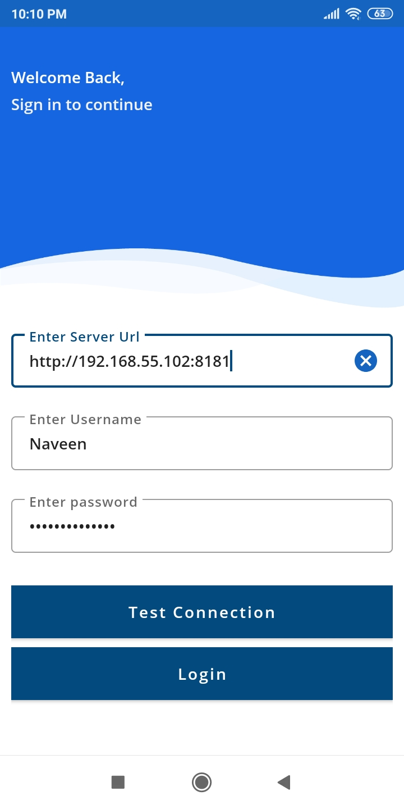
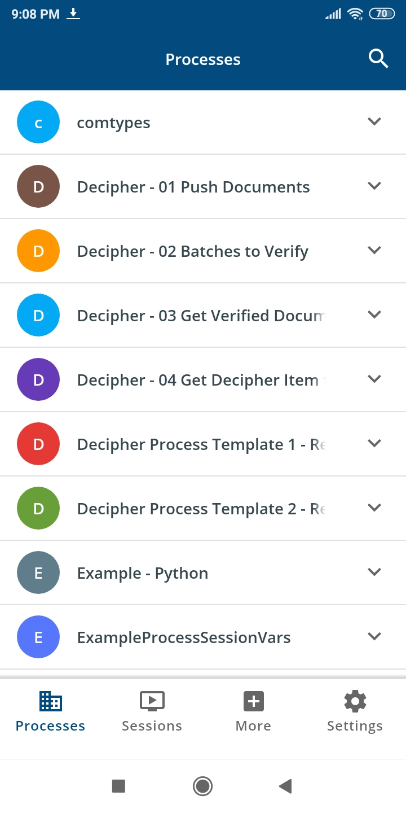
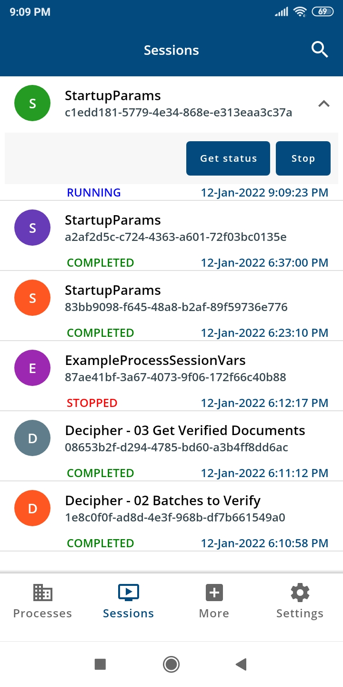
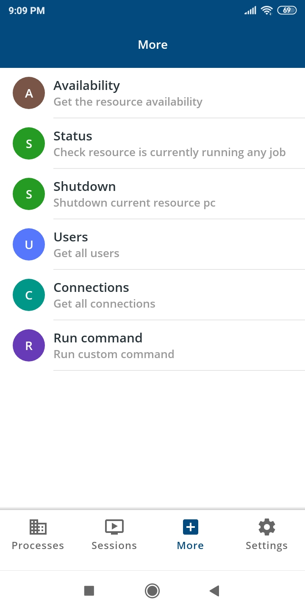
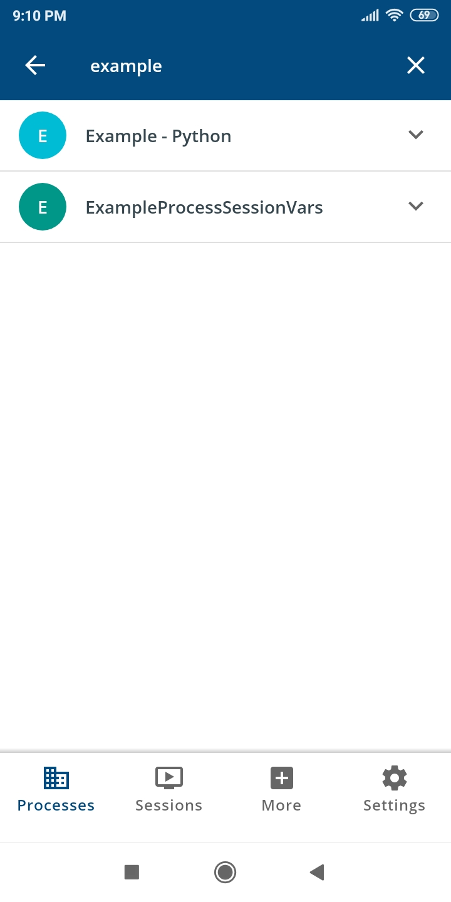
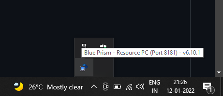
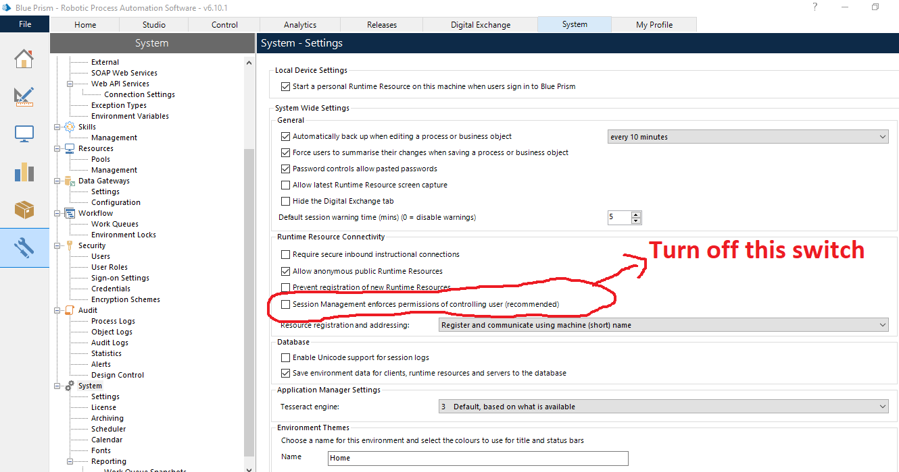

# Run-process-from-android
Run processes from android application.  
This application is developed based on [Link](https://bpdocs.blueprism.com/bp-6-9/en-us/helpResourcePCCommands.htm?tocpath=Interface%7CAdvanced%20options%7C_____4 "BP Resource pc commands").

# Screenshots.

   
     
     
   
   
   

# Prerequisites
Make sure the target resource pc is running like below. 

  
Make sure under system tab "Session management enforces permissions of controlling user" option is diabled like below 

 

